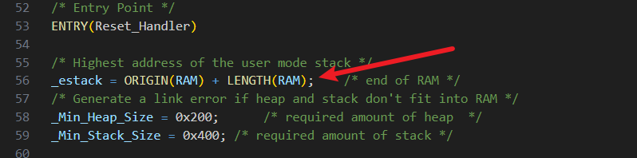
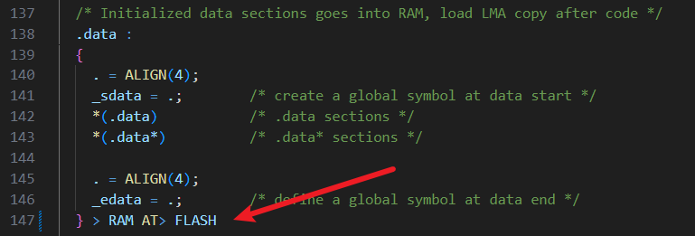
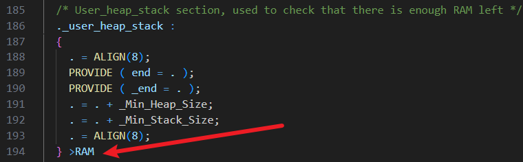

## **特别注意** 
### 在使用cubmx重新生成代码时，需要重新修改一下STM32F427IIHx_FLASH.ld文件，否则会出现链接错误,具体修改部分如下：

## 接线 
 
| A板标签上的丝印   |    STM32F427引脚   |      模块引脚    |      补充说明    |
|:-----------------:|:------------------:|:----------------:|:--------------:|
|        I1         |         PF1        |    XH711_DT      |    无           |
|        I2         |         PF0        |    XH711_SCK     |    无          |
|         +         |         VCC        |    XH711_VCC     |    5.0V       |
|         G         |         GND        |    XH711_GND     |   GND        |
|        A          |         PI0         |    TIM5_CH4      |   装填舵机_4    |
|        B         |         PH12        |    TIM5_CH3     |   装填舵机_3    |
|         C         |        PH11        |    TIM5_CH2     |   装填舵机_2    |
|         D         |        PH10        |    TIM5_CH1     |   装填舵机_1    |
|         E         |        PD15        |    TIM4_CH4     |   扳机舵机    |
|        I2         |                    |     COM         |   微动开关扳机红线    |
|        G         |           PD13         |     NO         |   微动开关黑线    |
|        +         |           PD12         |     NO         |   微动开关白线    |
|          J-K-L    |